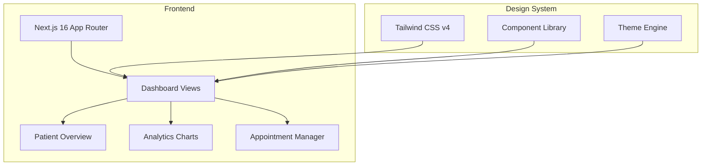

# Medical Dashboard - Modern Healthcare Analytics Interface

> High-performance medical dashboard built with Next.js 16 and React 19, delivering real-time healthcare analytics with a responsive, accessible design system.

[](https://nextjs.org)
[](https://react.dev)
[](https://typescriptlang.org)
[](https://tailwindcss.com)
[](LICENSE)

---

## Overview

Medical Dashboard is a modern healthcare analytics interface designed for clinical and administrative teams. It provides a clean, high-performance environment for monitoring patient metrics, managing appointments, and visualizing operational data across healthcare facilities.

Built on Next.js 16 App Router with React 19 and Tailwind CSS v4, the dashboard leverages the latest stable releases for optimal server-rendering performance, smallest possible bundle size, and a best-in-class developer experience.

---

## Architecture



---

## Key Features

### Dashboard Interface
- Patient overview with real-time status indicators
- Analytics charts for clinical and operational KPIs
- Appointment management with calendar integration
- Staff scheduling and workload visualization
- Inventory and supply status monitoring

### Performance
- Server-Side Rendering (SSR) for instant first paint
- React Server Components for minimal client JavaScript
- Streaming responses with Suspense boundaries
- Automatic static optimization for non-dynamic routes
- Image optimization via Next.js Image component

### Design System
- Tailwind CSS v4 with the latest design tokens
- Dark mode support with system preference detection
- Fully responsive across mobile, tablet, and desktop
- Accessible components following WCAG 2.1 AA guidelines
- Consistent spacing, typography, and color scales

### Type Safety
- TypeScript strict mode across the entire codebase
- End-to-end type safety from API to component props
- Zod schema validation for all data boundaries
- No implicit `any` types

---

## Tech Stack

| Layer | Technology |
|-------|-----------|
| Framework | Next.js 16 (App Router) |
| UI Library | React 19 |
| Language | TypeScript (strict mode) |
| Styling | Tailwind CSS v4 |
| Linting | ESLint |
| Package Manager | npm |

---

## Getting Started

### Prerequisites

- Node.js 20+
- npm

### Installation

```bash
git clone https://github.com/lydianai/medical.ailydian.com.git
cd medical.ailydian.com
npm install
```

### Environment Setup

```bash
cp .env.example .env.local
# Configure your environment variables
```

### Development

```bash
npm run dev
# Opens http://localhost:3000
```

### Production Build

```bash
npm run build
npm start
```

### Linting

```bash
npm run lint
```

---

## Project Structure

```
medical.ailydian.com/
├── app/                    # Next.js 16 App Router
│   ├── (dashboard)/        # Dashboard route group
│   │   ├── patients/       # Patient management
│   │   ├── analytics/      # Charts and KPIs
│   │   └── appointments/   # Scheduling
│   ├── api/                # API route handlers
│   └── layout.tsx          # Root layout with theme
├── components/             # Shared UI components
│   ├── charts/             # Data visualization
│   ├── forms/              # Form components
│   └── layout/             # Navigation and shell
├── lib/                    # Utilities
│   ├── api/                # API client functions
│   └── utils/              # Helper functions
└── public/                 # Static assets
```

---

## Deployment

The application is optimized for deployment on Vercel. The included `vercel.json` provides production-ready configuration.

```bash
vercel deploy --prod
```

For other platforms, run `npm run build` and serve the `.next` output directory with any Node.js-compatible host.

---

## Security

Security vulnerabilities should be reported privately. See [SECURITY.md](SECURITY.md) for our responsible disclosure policy.

---

## License

Copyright (c) 2024-2026 Lydian (AiLydian). All Rights Reserved.

This software is proprietary. See [LICENSE](LICENSE) for full terms.

---

## Contact

- Website: [https://www.ailydian.com](https://www.ailydian.com)
- Email: sardagemrah@gmail.com
