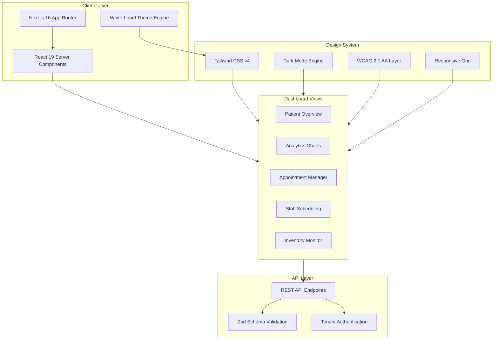

<div align="center">

# MedBoard

### White-Label Healthcare Analytics Dashboard SaaS
### Beyaz Etiket Saglik Analitik Paneli SaaS Platformu

[](https://medical.ailydian.com)
[]()
[]()
[]()

</div>

---

## Preview

<div align="center">

```
+------------------------------------------------------------------+
|  MedBoard Dashboard                                    [Dark Mode]|
+------------------------------------------------------------------+
|         |                                                         |
| [Nav]   |  Patient Overview          Today: 247 Active Patients   |
| Home    |  +----------+ +----------+ +----------+ +----------+    |
| Patients|  | Critical | | Stable   | | Discharged| | Pending  |   |
| Analytics| |    12    | |   185    | |     38    | |    12    |   |
| Appts   |  +----------+ +----------+ +----------+ +----------+    |
| Staff   |                                                         |
| Supply  |  Analytics Charts                                       |
|         |  +-------------------------+ +-------------------------+ |
|         |  | Admission Trends (7d)   | | Revenue by Department   | |
|         |  | ~~~~/\~~~~~/\~~~~~/\~~~ | | [===========] Cardiology| |
|         |  | ~~/    \~~/    \~/    \ | | [========]    Oncology  | |
|         |  +-------------------------+ +-------------------------+ |
|         |                                                         |
|         |  Appointments Calendar                                  |
|         |  +-----------------------------------------------------+|
|         |  | Mon  | Tue  | Wed  | Thu  | Fri  | Sat  | Sun      ||
|         |  | [3]  | [7]  | [5]  | [8]  | [4]  | [1]  | [-]      ||
|         |  +-----------------------------------------------------+|
+------------------------------------------------------------------+
```

<em>MedBoard Dashboard - Real-time Patient KPIs, Analytics Charts, and Appointment Management</em>

</div>

---

## Executive Summary

MedBoard is a white-label healthcare analytics dashboard designed to be embedded within existing hospital management systems, clinic portals, and telemedicine platforms. Rather than competing with full-stack EHR systems, MedBoard fills a critical gap: healthcare organizations need modern, real-time analytics interfaces but lack the engineering resources to build them. MedBoard provides a plug-and-play dashboard SaaS that integrates via API in under 48 hours.

Built on Next.js 16 with React 19 Server Components and Tailwind CSS v4, MedBoard delivers sub-200ms render times with WCAG 2.1 AA accessibility compliance out of the box. The platform supports dark mode, responsive layouts across all device types, and white-label customization including logo, color themes, and domain mapping. Each dashboard instance is fully isolated with tenant-specific data boundaries and HIPAA-compliant access controls.

The business model is straightforward SaaS: healthcare organizations pay $200-$2,000/month based on user count and feature tier, with zero upfront cost and a 14-day free trial. With 900,000+ clinics in the US alone and growing demand for data-driven healthcare operations, MedBoard targets the underserved small-to-medium healthcare provider market.

## Yonetici Ozeti

MedBoard, mevcut hastane yonetim sistemleri, klinik portallari ve telesaglik platformlarina gomulecek sekilde tasarlanmis bir beyaz etiket saglik analitik panelidir. Tam EHR sistemleriyle rekabet etmek yerine, MedBoard kritik bir boslugu doldurur: saglik kuruluslari modern, gercek zamanli analitik arayuzlerine ihtiyac duyar ancak bunlari olusturmak icin muhendislik kaynaklarina sahip degildir.

Next.js 16 ve React 19 Server Components uzerine insa edilen MedBoard, kutudan cikar cikmaz WCAG 2.1 AA erisilebilirlik uyumuyla 200ms'nin altinda render sureleri sunar. Koyu mod, tum cihaz turlerinde duyarli duzenler ve logo, renk temalari ve alan adi eslemesi dahil beyaz etiket ozellestirmesini destekler. Is modeli dogrudan SaaS'tir: aylik 200$ - 2.000$ abonelik ile sifir on maliyet.

---

## Key Metrics

| Metric | Value |
|--------|-------|
| First Contentful Paint | < 200ms (Server Components) |
| Client JS Bundle | Minimal (RSC streaming) |
| Accessibility | WCAG 2.1 AA Compliant |
| Integration Time | < 48 hours via REST API |
| Device Support | Mobile, Tablet, Desktop |
| Theme System | Full white-label customization |
| Data Isolation | Tenant-level HIPAA boundaries |

---

## Revenue Model & Projections

### Business Model

**White-Label Dashboard SaaS** ($200 - $2,000/month) based on active users, feature modules, and customization level. 14-day free trial, no setup fees, API-first integration.

| Tier | Monthly Price | Features |
|------|--------------|----------|
| Starter | $200/mo | 10 users, core dashboard, 3 chart types |
| Professional | $500/mo | 50 users, all analytics, calendar, dark mode |
| Enterprise | $1,000/mo | Unlimited users, white-label, custom domain |
| Premium | $2,000/mo | Dedicated instance, SLA, priority support |

### 5-Year Revenue Forecast

| Year | Subscribers | ARR | YoY Growth |
|------|-------------|-----|------------|
| Y1 | 25-50 | $60K | - |
| Y2 | 100-200 | $240K | 300% |
| Y3 | 300-500 | $800K | 233% |
| Y4 | 600-1,000 | $2M | 150% |
| Y5 | 1,200-2,000 | $5M | 150% |

---

## Market Opportunity

| Segment | Size |
|---------|------|
| **TAM** - Global Healthcare Analytics | $50B (2025) |
| **SAM** - US + EU White-Label Dashboard Market | $8B |
| **SOM** - Small-to-Medium Clinic Analytics | $500M (first 5 years) |

**Key Market Drivers:**
- 900,000+ clinics in the US lack modern analytics dashboards
- 73% of healthcare providers plan to invest in analytics tools by 2027
- White-label model eliminates vendor lock-in anxiety for procurement teams
- WCAG compliance increasingly required by US federal healthcare contracts

---

## Tech Stack

<p>
  
  
  
  
  
  
  
</p>

---

## Competitive Advantages

- **48-Hour Integration**: API-first architecture allows healthcare platforms to embed MedBoard in under 2 days, vs. months for custom dashboard development
- **White-Label Ready**: Full branding customization (logo, colors, domain, email templates) without any code changes
- **Server Components Architecture**: React 19 RSC delivers near-zero client JavaScript, resulting in instant load times even on hospital network bandwidth
- **Accessibility-First**: WCAG 2.1 AA compliance built into every component, meeting US federal Section 508 requirements
- **Multi-Tenant Isolation**: Each client gets fully isolated data boundaries with HIPAA-compliant access controls and audit logging

---

## Architecture



---

## Getting Started

```bash
# Clone the repository
git clone https://github.com/lydianai/medical.ailydian.com.git
cd medical.ailydian.com

# Install dependencies
npm install

# Set up environment variables
cp .env.example .env.local

# Run development server
npm run dev
# Opens http://localhost:3000

# Production build
npm run build && npm start

# Lint
npm run lint
```

---

## Project Structure

```
medical.ailydian.com/
├── app/                    # Next.js 16 App Router
│   ├── (dashboard)/        # Dashboard route group
│   │   ├── patients/       # Patient management
│   │   ├── analytics/      # Charts and KPIs
│   │   └── appointments/   # Scheduling
│   ├── api/                # API route handlers
│   └── layout.tsx          # Root layout with theme
├── components/             # Shared UI components
│   ├── charts/             # Data visualization
│   ├── forms/              # Form components
│   └── layout/             # Navigation and shell
├── lib/                    # Utilities
│   ├── api/                # API client functions
│   └── utils/              # Helper functions
└── public/                 # Static assets
```

---

## Security & Compliance

| Standard | Status | Details |
|----------|--------|---------|
| HIPAA | Ready | Tenant-level data isolation, audit logs |
| WCAG 2.1 AA | Compliant | All components accessibility-tested |
| OWASP Top 10 | Verified | Input validation, XSS prevention |
| Encryption | TLS 1.3 | All data in transit encrypted |
| Section 508 | Compliant | US federal accessibility standard |

---

## Contact

| | |
|---|---|
| **Email** | info@ailydian.com |
| **Email** | ailydian@ailydian.com |
| **Web** | https://ailydian.com |
| **Platform** | https://medical.ailydian.com |

---

## License

Copyright (c) 2025-2026 AiLydian. All Rights Reserved.

This software is proprietary and confidential. Unauthorized copying, distribution, or modification of this software, via any medium, is strictly prohibited. Licensed exclusively under white-label SaaS agreement.
